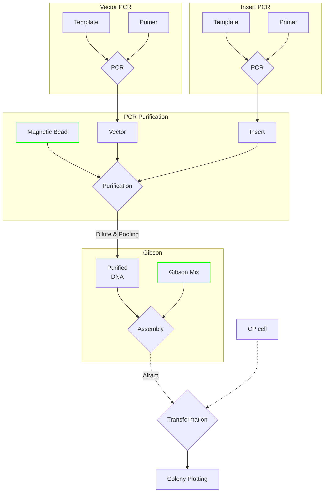

# Cloning

Macrogen 96-well plate Input을 받아 바로 Assembly를 진행할 수 있게 설계  

PCR 부터 Transformation 까지 `Full-automation` 진행  
`Input Materials`
> Template[Vector, Insert]  
> Primer[Vector, Insert]  
> PCR master mix  
> Magnetic Bead  
> Assembly master mix[Gibson]  
> Competent Cell  
> Square plate

Flow Diagram

## Usage

Input (Plate1)
| Well | Name        | Volume(opt) |
| ---- | ----------- | ----------- |
| A1   | newRiboJ-F  |             |
| A2   | newRiboJ-R  |             |
| B1   | TemplateDNA |             |
- 각 Plate별 DB에 사전 저장    
- Excel, JSON 형식으로 입력

Input (Plate2)
| Well | Name | Template          | Primer     | Primer2    | Primer3   |
| ---- | ---- | ----------------- | ---------- | ---------- |
| A1   | DNA1 | pRSFduet1_newRC34 | newRiboJ-F | newRiboJ-R |
| B1   | DNA2 | pRSFduet1_newRC32 | newRiboJ-F | newRiboJ-R |
| C1   | DNA3 | pRSFduet1_newRC32 |            | newRiboJ-R | newprimer |

Input & Output (Plate2)
| Well | Name | Template (1)      | DNA (1) | DNA (2) | DNA (3)  | Enzyme (10)               | Enzyme (0.3) |
| ---- | ---- | ----------------- | ------- | ------- | -------- | ------------------------- | ------------ |
| A9   | Vec1 | pRSFduet1_newRC34 | DNA1    | DNA2    | DNA3 (3) | NEBuilder HiFi master Mix | Dpn1         |
| B9   | Vec2 | pRSFduet1_newRC32 | DNA1    | DNA2    |
| C9   | Vec3 | pRSFduet1_newRC32 | DNA1    |         |          | NEBuilder HiFi master Mix | Dpn1         |
- 수행할 프로토콜 별로 Column 이름을 정해둠