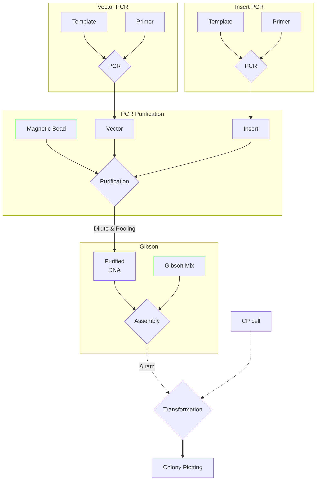

# Cloning
PCR 부터 Transformation 까지 `Full-automation` 진행  
`Input Materials`
> Template[Vector, Insert]  
> Primer[Vector, Insert]  
> PCR master mix  
> Magnetic Bead  
> Assembly master mix[Gibson]  
> Competent Cell  
> Square plate

Flow Diagram

## Usage