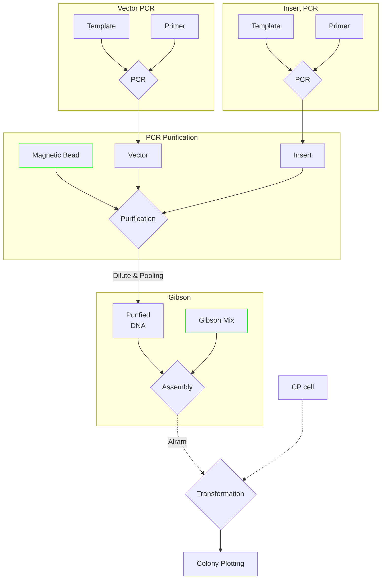

# Cloning

Macrogen 96-well plate Input을 받아 바로 Assembly를 진행할 수 있게 설계  

PCR 부터 Transformation 까지 `Full-automation` 진행  
`Input Materials`
> Template[Vector, Insert]  
> Primer[Vector, Insert]  
> PCR master mix  
> Magnetic Bead  
> Assembly master mix[Gibson]  
> Competent Cell  
> Square plate

Flow Diagram

## Usage
### Input (Plate1)
#### Long-form
| Well | Name         |
| ---- | ------------ |
| A1   | pACBB_vec-F1 |
| B1   | pACBB_vec-R1 |
| B6   | primer3      |
| C2   | primer4      |
| E7   | primer5      |
| F9   | primer6      |

#### Wide-form

|     | 1            | 2       | 3   | 4   | 5   | 6       | 7       | 8   | 9   | 10  | 11  | 12  |
| --- | ------------ | ------- | --- | --- | --- | ------- | ------- | --- | --- | --- | --- | --- |
| A   | pACBB_vec-F1 |
| B   | pACBB_vec-R1 |         |     |     |     | primer3 |
| C   |              | primer4 |
| D   |              |
| E   |              |         |     |     |     |         | primer5 |
| F   |              |         |     |     |     | primer6 |

### Input (Plate2)
| Well | Name      |
| ---- | --------- |
| A1   | pACBB_4-5 |
| B1   | pET28a    |

### PCR Reaction (Plate3)
| Well | Tag | DNA (0.5) | DNA (0.75)   | DNA (0.75)   | Enzyme (12.5) | DW (25) |
| ---- | --- | --------- | ------------ | ------------ | ------------- | ------- |
| A1   | S1  | pACBB_4-5 | pACBB_vec-F1 | pACBB_vec-R1 | KODone        | DW      |
| B1   | S2  | pACBB_4-5 | pACBB_vec-F2 | pACBB_vec-R2 | KODone        | DW      |
| C1   | S3  | pACBB_4-5 | pACBB_T7-F1  | pACBB_T7-R1  | KODone        | DW      |
| D1   | S4  | pACBB_4-5 | pACBB_T7-F2  | pACBB_T7-R2  | KODone        | DW      |
| F1   | S5  | pACBB_4-5 | pET28_MCS-F1 | pET28_MCS-R1 | KODone        | DW      |

### Assembly Reaction (Plate3)
| Well | Tag  | DNA1 | DNA2 | DNA3 | Enzyme (10)               | DW (20) |
| ---- | ---- | ---- | ---- | ---- | ------------------------- | ------- |
| A9   | vec1 | S1   | S2   |      | NEBuilder HiFi Master Mix | DW      |
| B9   | vec2 | S1   | S3   |      | NEBuilder HiFi Master Mix | DW      |
| C9   | vec3 | S2   | S3   |      | NEBuilder HiFi Master Mix | DW      |
| D9   | vec4 | S1   | S2   | S3   | NEBuilder HiFi Master Mix | DW      |
| E9   | vec5 | S3   |      |      | NEBuilder HiFi Master Mix | DW      |

### Transformation (Plate4)
| Well | Name         |
| ---- | ------------ |
| A1   | vec1 |
| A2   | vec1 |
| A3   | vec1      |
| B1   | vec2      |
| B2   | vec2      |
| B3   | vec2      |
| C1   | vec3      |
| C2   | vec3      |
| C3   | vec3      |
| D1   | vec4      |
| D2   | vec4      |
| D3   | vec4      |
| E1   | vec5      |
| E2   | vec5      |
| E3   | vec5      |